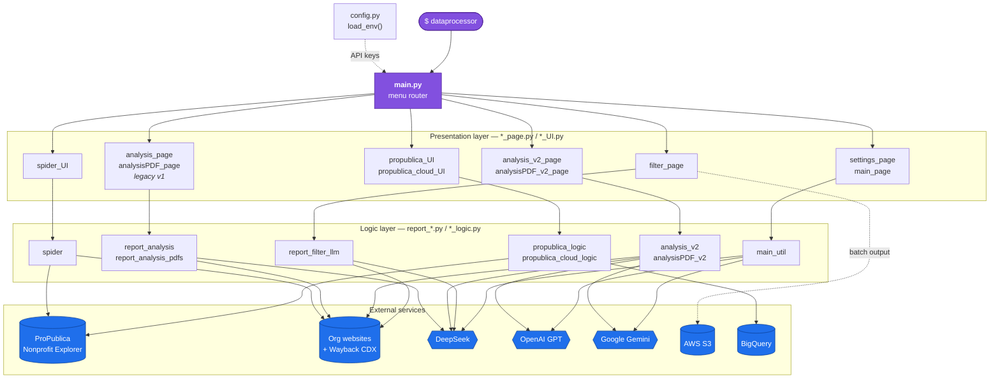
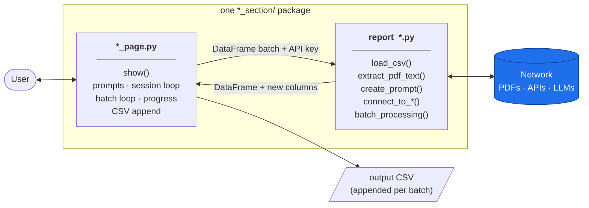
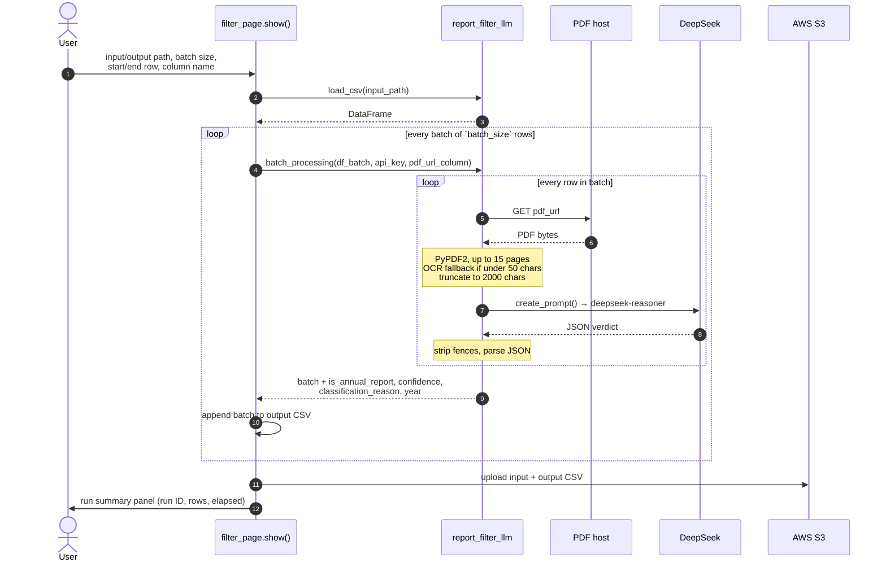
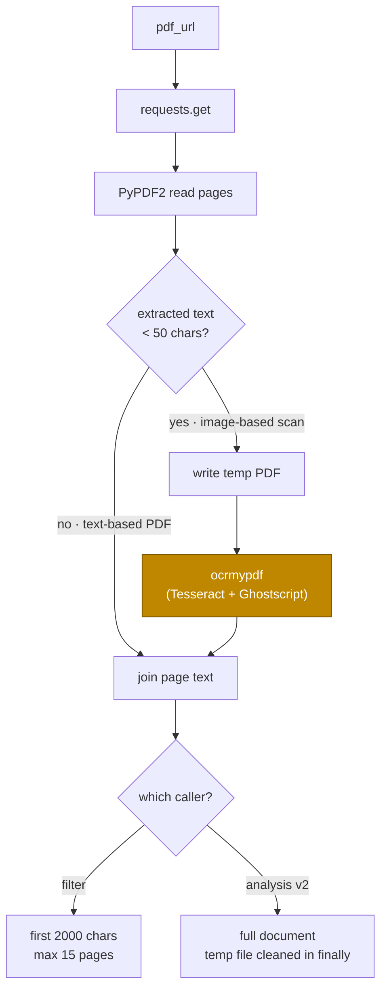
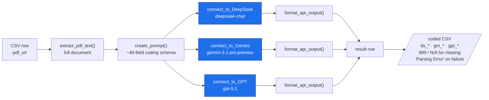
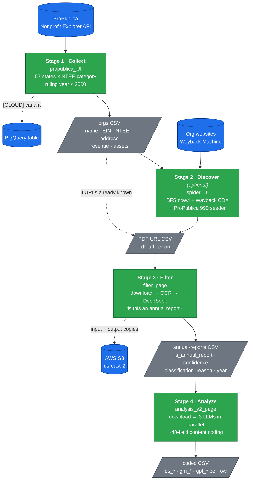

# DataProcessor — Project Documentation

A terminal application for collecting U.S. nonprofit data and running large-language-model (LLM) analysis over the PDF annual reports those organizations publish. It is an interactive CLI built with [Rich](https://github.com/Textualize/rich) (styled output) and [questionary](https://github.com/tmbo/questionary) (prompts), packaged with [uv](https://docs.astral.sh/uv/) as an installable command-line tool (`dataprocessor`).

---

## 1. What it does

The app supports an end-to-end pipeline:

1. **Collect** nonprofit organizations from the **ProPublica Nonprofit Explorer API** (filtered by NTEE category, state, and ruling year) into a CSV.
2. **Filter** a CSV of PDF URLs — download each PDF, extract its text (OCR if needed), and ask an LLM whether it is an *annual report* (and what year it covers).
3. **Analyze** the annual reports — send each PDF's text to **three LLMs in parallel** (DeepSeek, GPT, Gemini) and extract a structured, ~40-field political/cultural content coding of the organization.

Results are written to CSV progressively (one batch at a time, appended) and, for the filter step, uploaded to AWS S3.

---

## 2. Tech stack & dependencies

| Concern | Library |
|---|---|
| Terminal UI / styling | `rich` |
| Interactive prompts | `questionary` |
| Data handling | `pandas` |
| HTTP | `requests` |
| PDF text extraction | `PyPDF2` |
| OCR (image-based PDFs) | `ocrmypdf` |
| LLM clients | `openai` (DeepSeek + GPT), `google-genai` (Gemini) |
| Cloud storage | `boto3` (AWS S3) |
| Config | `python-dotenv` |
| Timezones | `pytz` |
| BigQuery upload | `pandas-gbq` |
| Web crawling | `beautifulsoup4`, `pypdf` |
| Packaging | `uv` + `hatchling` |

Dependencies are declared in `pyproject.toml` and pinned in `uv.lock` — `uv sync` reproduces the exact environment. OCR additionally requires the system packages **Tesseract** and **Ghostscript** (`brew install tesseract ghostscript`).

---

## 3. Architecture

### 3.1 System diagram

Every feature is a **section package** hung off a single menu router, and every section splits the same way: a presentation module that talks to the user, and a logic module that talks to the outside world. Nothing in the presentation layer calls an external service directly except the S3 upload in `filter_page`.



**Reading the layers**

| Layer | Responsibility | Never does |
|---|---|---|
| `main.py` | Route the menu choice to one section's `show()` | Any work of its own |
| `*_page.py` / `*_UI.py` | Prompts, batch loop, progress bars, CSV append | Parse PDFs or call LLMs |
| `report_*.py` / `*_logic.py` | HTTP, PDF/OCR, LLM calls, data shaping | Print to the user or ask questions |
| `config.py` | Resolve `.env` from two locations | Validate individual keys |

Each section owns its own **session loop** (`while status:`) and returns to the caller only when the user confirms exit, so sections never call each other — the pipeline is chained by CSV files on disk, not by imports.

### 3.2 Module tree

```
DataProcessor/
├── pyproject.toml                # package metadata, dependencies, `dataprocessor` entry point
├── uv.lock                       # pinned dependency versions (commit this)
├── .env                          # API keys (gitignored — never commit)
├── output.csv                    # sample data
└── src/dataprocessor/
    ├── main.py                   # ENTRY POINT — top-level menu / router
    ├── config.py                 # load_env(): ~/.dataprocessor/.env, then nearest .env
    │
    ├── main_section/             # app shell
    │   ├── main_page.py          #   welcome screen, process overviews, LLM status
    │   ├── main_util.py          #   LLM connectivity test functions
    │   └── settings_page.py      #   shows API keys + live online/offline status
    │
    ├── propublica_section/       # data collection
    │   ├── propublica_UI.py      #   prompts, session loop, CSV append
    │   └── propublica_logic.py   #   ProPublica API search + detail + filtering
    │
    ├── filter_section/           # annual-report classification
    │   ├── filter_page.py        #   prompts, batch loop, S3 upload
    │   └── report_filter_llm.py  #   PDF extract + DeepSeek classify
    │
    ├── analysis_v2_section/      # CURRENT analysis engine (3-model coding)
    │   ├── analysis_v2_page.py   #   prompts, batch loop, CSV append
    │   └── analysis_v2.py        #   PDF extract + DeepSeek/GPT/Gemini + JSON parse
    │
    ├── analysisPDF_v2_section/   # variant: analysis from raw local PDF files
    ├── analysis_section/         # LEGACY v1 analysis (still wired into menu)
    ├── analysisPDF_section/      # LEGACY v1 raw-PDF analysis
    │
    ├── propublica_cloud_section/ # ProPublica collection with BigQuery output
    │
    ├── Spider_section/           # web crawler for PDF discovery
    │   ├── spider.py
    │   └── spider_UI.py
    │
    └── util/
        └── clean_csv.py          # standalone CSV cleaning helper
```

### 3.3 Section pattern
Most features follow a **UI / logic split**:
- `*_page.py` / `*_UI.py` — Rich/questionary presentation, input gathering, the batch loop, and CSV/S3 output.
- `report_*.py` / `*_logic.py` / `analysis_v2.py` — the actual work: HTTP calls, PDF parsing, LLM calls, data shaping.



Because output is appended **per batch** rather than at the end, a crashed or cancelled run keeps everything it already processed — resume by setting `Start row` to where it stopped.

---

## 4. How it runs

### Entry point — `src/dataprocessor/main.py`
1. Imports every section module.
2. `main_page.show()` prints the welcome banner, LLM token-cost table, process overviews, and live LLM status.
3. A `questionary.select` menu routes to one section's `show()`:

| Menu choice | Module | Purpose |
|---|---|---|
| Filter Data | `filter_page` | Classify PDFs as annual reports (DeepSeek) |
| LLM Analysis - PDF URL | `analysis_page` | **v1** analysis from PDF URLs |
| LLM Analysis - Raw PDF | `analysisPDF_page` | **v1** analysis from local PDFs |
| LLM Analysis V2 | `analysis_v2_page` | **v2** 3-model analysis from PDF URLs |
| LLM Analysis V2 - Raw PDF | `analysisPDF_v2_page` | **v2** 3-model analysis from local PDFs |
| Propublica API | `propublica_UI` | Collect orgs from ProPublica |
| Propublica API [CLOUD] | `propublica_cloud_UI` | Collect orgs, output to Google BigQuery |
| Spider | `spider_UI` | Crawl sites to discover annual-report PDFs |
| Settings | `settings_page` | View keys + connection status |

Each section runs its own **interactive session loop** (`while status:`), asking to repeat or exit when a run finishes.

---

## 5. Feature details

### 5.1 ProPublica collection (`propublica_section`)
`populate_data(num_pages, ntee_catagory_id, start_state_index, end_state_index)`:
- Iterates over a fixed list of **57 U.S. states/territories** (sliced by start/end index) and paginates each one via `GET /nonprofits/api/v2/search.json` filtered by `ntee[id]` + `state[id]`.
- For each org, calls the detail endpoint `/organizations/{ein}.json` — but only if the NTEE code's first letter is in a target set (`R,X,C,D,B,P,A,N`) or the code ends in `01`.
- Keeps orgs with **ruling year ≤ 2000**, extracting name, EIN, NTEE code, ruling date, address, revenue, assets.
- Built-in `time.sleep` calls (5s between search pages, 1s between detail calls) to respect rate limits.
- Results appended to the chosen CSV (creates `output.csv` if a directory is given).

### 5.2 Filter / annual-report classification (`filter_section`)
Per row of the input CSV (`pdf_url` column by default):
1. `extract_pdf_text()` — download the PDF, read up to 15 pages with PyPDF2. If <50 chars of text are found, it's treated as image-based and run through **`ocrmypdf`** first. Returns first **2000 chars**. (Note: there is a hard-coded `time.sleep(30)` after each download.)
2. `create_prompt()` — builds a prompt asking DeepSeek to decide *is this an annual report?* and *what year does it cover?*
3. `DeepSeek_Connect()` — calls `deepseek-reasoner`, strips markdown fences, parses JSON.
4. Adds `is_annual_report`, `confidence`, `classification_reason`, `year` columns.

The page loop processes in **batches**, appends each batch to the output CSV, then `upload_to_s3()` pushes both input and output files to the `dataprocessor-input-bucket` / `dataprocessor-output-bucket` buckets (region `us-east-2`), timestamped in America/Chicago time.



#### PDF text extraction — the OCR branch

Both the filter and the analysis engines share this shape; they differ only in the page cap and how much text they keep.



### 5.3 Analysis V2 (`analysis_v2_section`) — the main analytical engine
Per row:
1. `extract_pdf_text()` — same download/OCR approach but extracts the **full document** (uses a temp file for OCR and cleans it up in `finally`).
2. `create_prompt()` — a large structured-coding prompt instructing the model to act as a "rigorous content analyst" and return **only JSON** with ~40 fields across four sections:
   - **Section 1 — Identity coding:** primary in-group identity (1–12), intensity, out-group presence/type (13–24), us-vs-them polarization.
   - **Section 2 — Issue positions:** 8 issues (economy, social/cultural, race, immigration, environment, government size, globalism, individual-vs-systemic), each with a Position 0–100 and Intensity 0–100.
   - **Section 3 — Overall ideological intensity (0–100).**
   - **Section 4 — Metadata:** organization type (think tank / advocacy / foundation / hybrid).
   - Missing data convention: **`999` for numeric fields, `"N/A"` for text fields.**
3. The same prompt is sent to **all three models** — `connect_to_DeepSeek` (`deepseek-chat`), `connect_to_Gemini` (`gemini-3.1-pro-preview`, high thinking), `connect_to_GPT` (`gpt-5.1`) — each with retry/backoff.
4. `format_api_output()` robustly parses the JSON (strips fences, removes trailing commas, escapes raw newlines, regex-extracts the `{...}` block, tries multiple candidates).
5. Each model's fields are flattened onto the result row with a prefix: **`ds_`, `gm_`, `gpt_`** (e.g. `ds_ID_Primary`, `gpt_OVERALL_Intensity`). On parse failure, fields are set to `"Parsing Error"`.

Output is appended to CSV per batch.



The same prompt goes to all three models so their codings are directly comparable column-for-column — the point of the `ds_` / `gm_` / `gpt_` prefixes is inter-rater agreement, not redundancy.

### 5.4 Settings (`main_section/settings_page.py`)
Displays the configured API keys and runs live connectivity tests (`main_util.DeepSeek_connect_test` / `GTP_connect_test` / `Gemini_connect_test`) showing each model **Online/Offline**.

---

## 6. Configuration

Configuration is loaded by `dataprocessor/config.py::load_env()`, which reads **two locations in order**:

1. `~/.dataprocessor/.env` — for people who installed the tool with `uv tool install` (no project folder needed).
2. The nearest `.env` walking up from the current directory — for development, this finds the project-root `.env` (gitignored).

Required variables:

```dotenv
DeepSeek_key=...                          # DeepSeek API key
GPT_key=...                               # OpenAI API key
Gemini_key=...                            # Google Gemini API key
GOOGLE_APPLICATION_CREDENTIALS=/path/to/service-account.json   # only for Propublica [CLOUD] / BigQuery
```

The version shown in the UI comes from the package metadata (`pyproject.toml`), not from `.env`.

AWS credentials for the S3 upload step are expected via the standard boto3 mechanisms (env vars / `~/.aws/credentials` / IAM role) — they are **not** read from `.env`.

> 🔒 Never commit `.env` or service-account JSON files. Both are gitignored and excluded from the built package.

---

## 7. External services

- **ProPublica Nonprofit Explorer API** — `https://projects.propublica.org/nonprofits/api/v2` (no key required).
- **DeepSeek** — `https://api.deepseek.com` (`deepseek-chat`, `deepseek-reasoner`).
- **OpenAI / GPT** — via `openai` SDK (`gpt-5.1`, `gpt-4.1` for the connection test).
- **Google Gemini** — via `google-genai` (`gemini-3.1-pro-preview`).
- **AWS S3** — buckets `dataprocessor-input-bucket`, `dataprocessor-output-bucket` (region `us-east-2`).

---

## 8. Running & installing

### Development (from a clone of the repo)
```bash
uv run dataprocessor
```
`uv run` creates/updates the `.venv` automatically and installs anything missing, then launches the app. Keep API keys in the project-root `.env`.

### Install on another laptop (teammates)

Prerequisites: collaborator access to this GitHub repo (ask the owner for an invite), and a GitHub login on the machine — `gh auth login` is the easiest, an SSH key already registered with GitHub also works.

```bash
# 1. Install uv (installs its own Python — no system Python needed)
curl -LsSf https://astral.sh/uv/install.sh | sh
# ... restart the terminal, then:

# 2. Authenticate with GitHub (private repo — you must be invited as a collaborator first)
brew install gh && gh auth login     # choose HTTPS when prompted
uv tool install git+https://github.com/seiamwatt/DataProcessor

# ...or, if you'd rather use an SSH key you've already added to GitHub:
uv tool install git+ssh://git@github.com/seiamwatt/DataProcessor

# 3. Add API keys (see section 6 for the variable names)
mkdir -p ~/.dataprocessor
nano ~/.dataprocessor/.env

# 4. (Only for OCR of image-based PDFs)
brew install tesseract ghostscript

# 5. Run it
dataprocessor
```

### Upgrading after a new version is pushed
```bash
uv tool upgrade dataprocessor
```

### Releasing a new version (maintainer)
1. Bump `version` in `pyproject.toml`.
2. Commit and push to GitHub.
3. Tell teammates to run `uv tool upgrade dataprocessor`.

---

## 9. Data flow summary

Stages are chained by **CSV files on disk**, not by code — each one is a separate menu choice you run yourself, so you can start at any stage with a CSV from elsewhere.



**Filter before analyze.** Stage 3 exists to keep stage 4 cheap — analysis sends the *full* document text to three models per row, so discarding non-annual-reports first is where most of the token cost is saved.

---

